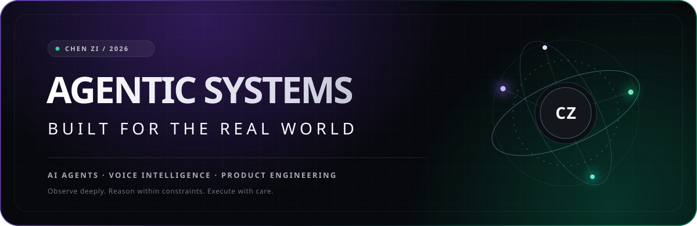
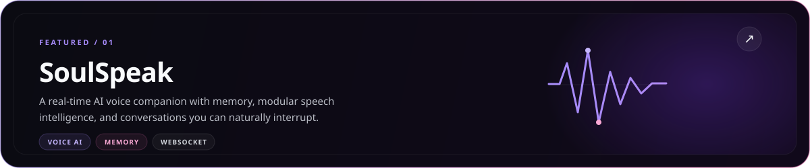
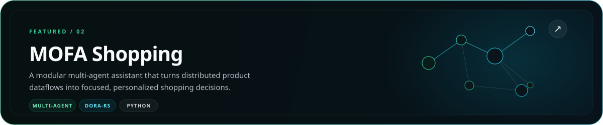
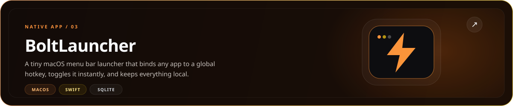
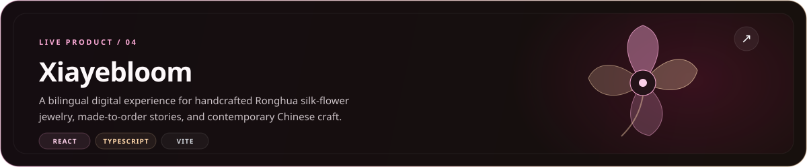

<div align="center">
  <picture>
    <source media="(max-width: 640px)" srcset="./assets/hero-mobile.svg" />
    
  </picture>
</div>

<br />

<div align="center">

[](https://github.com/chengzi0103)


**I turn AI capabilities into systems people can actually use.**  
让智能系统真正进入工作流，而不只停留在聊天框里。

</div>

<br />

<table>
<tr>
<td width="58%" valign="top">

### 01 / What I build

Agentic software for work that has context, constraints, and consequences.

- Multi-agent orchestration and tool-using workflows
- Real-time voice AI with memory and interruption
- Native apps and focused digital products

</td>
<td width="42%" valign="top">

### 02 / How I build

**Useful over theatrical.**  
**Observable over opaque.**  
**Safe execution over confident demos.**

I care about the full path from an idea to a product that can be tested, trusted, and improved.

</td>
</tr>
</table>

## Products & Apps

<a href="https://github.com/chengzi0103/SoulSpeak">
  <picture>
    <source media="(max-width: 640px)" srcset="./assets/soulspeak-mobile.svg" />
    
  </picture>
</a>

<br />

<a href="https://github.com/chengzi0103/mofa_berkeley_hackathon">
  <picture>
    <source media="(max-width: 640px)" srcset="./assets/mofa-shopping-mobile.svg" />
    
  </picture>
</a>

<br />

<a href="https://github.com/YarnBall-CC/boltlauncher">
  <picture>
    <source media="(max-width: 640px)" srcset="./assets/boltlauncher-mobile.svg" />
    
  </picture>
</a>

<br />

<a href="https://xiayebloom.com/">
  <picture>
    <source media="(max-width: 640px)" srcset="./assets/xiayebloom-mobile.svg" />
    
  </picture>
</a>

## Working stack

<p>
  
  
  
  
  
  
  
</p>

```text
observe(context) → reason(constraints) → simulate(outcomes) → execute(safely)
```

<div align="center">

### Build systems with memory, judgment, and real-world consequences.

Explore the products above, or start with [SoulSpeak](https://github.com/chengzi0103/SoulSpeak).

</div>
